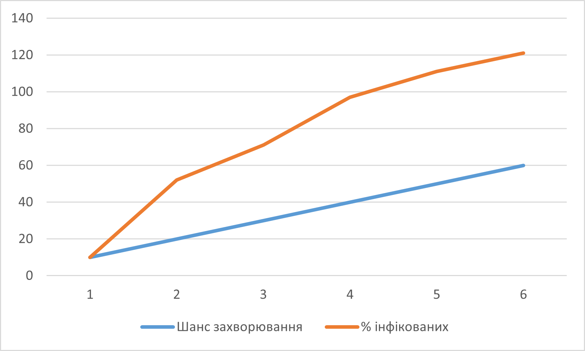
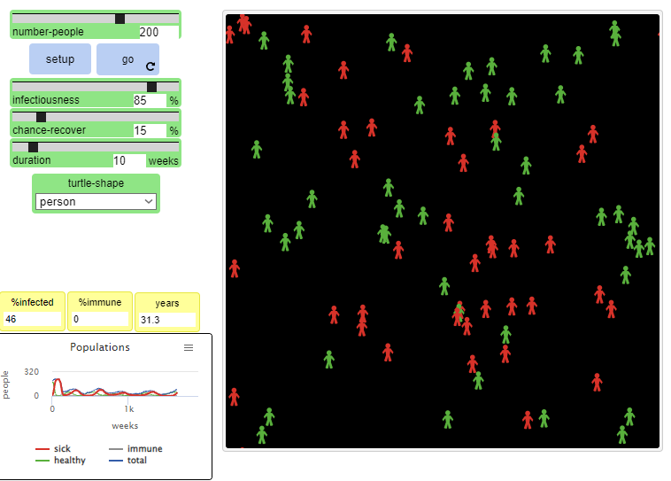

## СПм-22-6, Поповкін Максим Максимович
### Лабораторна робота №**1**. Опис імітаційних моделей та проведення обчислювальних експериментів

 

### Варіант 3, модель у середовищі NetLogo: Virus. Модель поширення захворювання у людській популяції.
[Virus](https://www.netlogoweb.org/launch#https://www.netlogoweb.org/assets/modelslib/Sample%20Models/Biology/Virus.nlogo)

 

### Вербальний опис моделі:
Ця модель імітує передачу та збереження вірусу в людській популяції. Модель ініціалізована 150 людьми, з яких 10 заражені. Люди випадково пересуваються по світу в одному з трьох станів: здорові, але сприйнятливі до інфекції (зелений), хворі та інфекційні (червоний) і здорові та імунні (сірий). Люди можуть померти від інфекції або старості. Коли популяція падає нижче "пропускної здатності" середовища (встановленої на рівні 300 у цій моделі), здорові люди можуть народжувати здорове (але сприйнятливе) потомство.

### Параметри Setup:
- **number-people** - кількість людей на початку.
- **turtle-shape** - метод відображення агентів(люди або бульбашки).

### Параметри, що можуть надавати вплив під час роботи симуляції:
- **infectiousness** - Легкість передавання зарази.
- **chance-recover** - Ймовірність одужати.
- **duration** - Тривалість одужання.

### Показники роботи системи:
- %infected - Процент інфікованих людей.
- %immune - Процент людей з імунітетом.
- %years - Кількість прожитих популяцією років.

### Примітки:
1) У моделі на старті забов'язано бути 10 інфікованих, що виключає можливість досліджувати меншу кількість.
2) На початку симуляції часто відбувається вибух інфекції, оскільки ніхто з населення не застрахований.

### Недоліки моделі:
1) Відсутність потреби лікарні для одужання.
2) Здорові люди не намагаються уникати контакту з хворими.
3) Для появи нащадка немає умови у 2 предка.
 

## Обчислювальні експерименти
 
### 1. Вплив шансу зараження на кількість хворих:
Досліджується вплив **infectiousness** на **%infected**.
Експерименти проводяться при початковій кількості 100 агентів, тривалістю 20 років.  
Інші керуючі параметри мають значення за замовчуванням:
- **chance-recover** 50%
- **duration** 50

<table>
<thead>
<tr><th>Шанс захворювання</th><th>% інфікованих</th></tr>
</thead>
<tbody>
<tr><td>10</td><td>0</td></tr>
<tr><td>20</td><td>32</td></tr>
<tr><td>30</td><td>41</td></tr>
<tr><td>40</td><td>57</td></tr>
<tr><td>50</td><td>61</td></tr>
<tr><td>60</td><td>61</td></tr>
</tbody>
</table>

Важливо відмітити, що після шансу захворювання >30 показники не надто відрізнялися, а інфекція навіть через 200 років не зникла.

### 2. Вплив терміну дії інфекції на кількість хворих
Досліджується вплив **duration** на **%infected**.
Експерименти проводяться при початковій кількості 100 агентів, тривалістю 20 років.  
Інші керуючі параметри мають значення за замовчуванням:
- **chance-recover** 50%
- **infectiousness** 50

<table>
<thead>
<tr><th>Тривалість захворювання</th><th>% інфікованих</th></tr>
</thead>
<tbody>
<tr><td>10</td><td>0</td></tr>
<tr><td>20</td><td>0</td></tr>
<tr><td>30</td><td>25</td></tr>
<tr><td>40</td><td>48</td></tr>
<tr><td>50</td><td>44</td></tr>
</tbody>
</table>

Ситуація у цьому експерименті дуже схожа на попередній - якщо тривалість хвороби буде <=20, то хвороба швидко зникає та у симуляції залишаються тількі здорові агенти. Але якщо тривалість буде 30+ тижнів, то хвороба не зникне зовсім.

### 3. Симуляція вірусу "Ебола"
Досліджується модель з параметрами, наближеними до ситуації з вірусом "Ебола". Вірус Ебола в Центральній Африці має дуже короткий термін дії, дуже високу заразність і надзвичайно низький рівень одужання. Попри весь страх, який викликав цей вірус, наскільки він успішний? У рамках симуляції буде досліджуватись тривалість в 30 років.
- **number-people** 200
- **infectiousness** 85
- **chance-recover** 15
- **duration** 8

Симуляція 1:

Симуляція 2:

Симуляція 3:

Симуляція 4

Симуляція 5

Дві симуляції з п'яти так і не змогли подолати вірус. Як можна побачити з графіків - більшість симуляцій, що подолали вірус мали велику вспишку інфікованих саме на початку, після чого вони померли або одужали та у симуляції залишились лише здорові люди.
