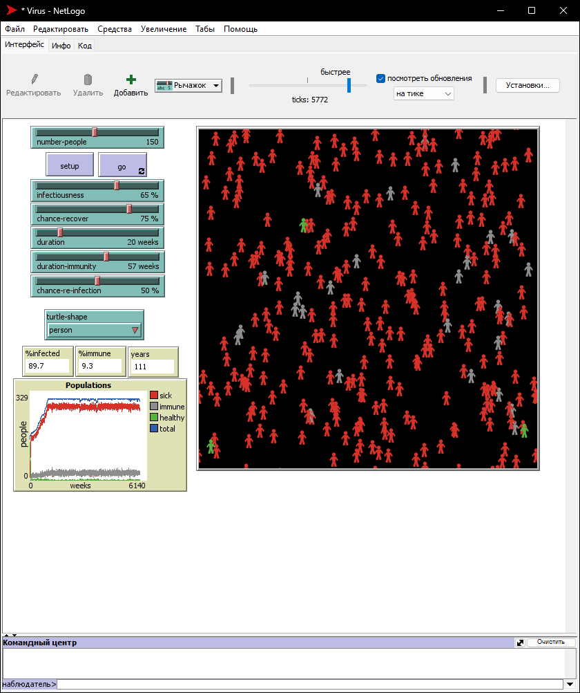
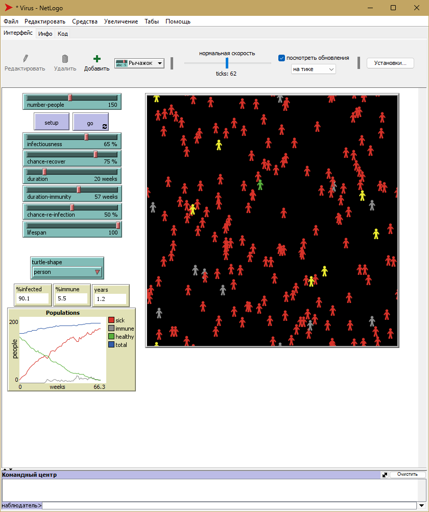
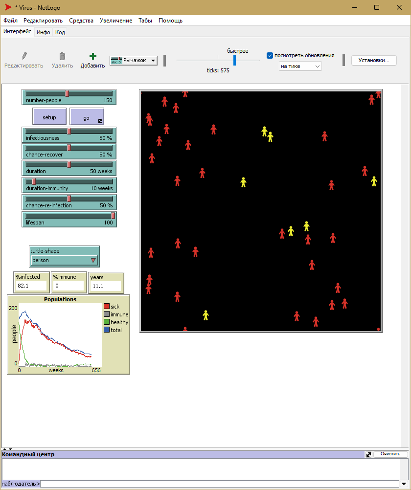
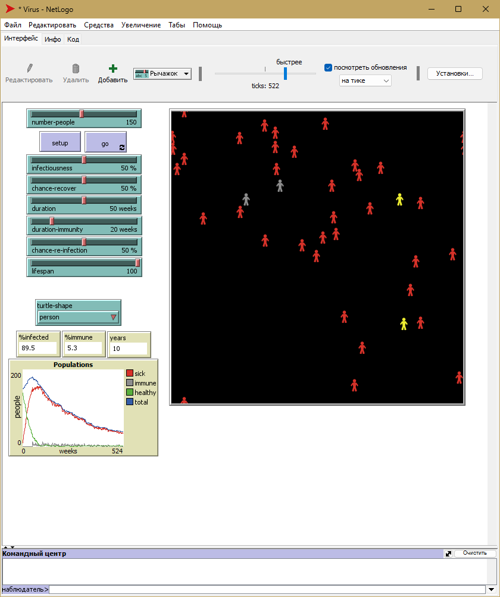
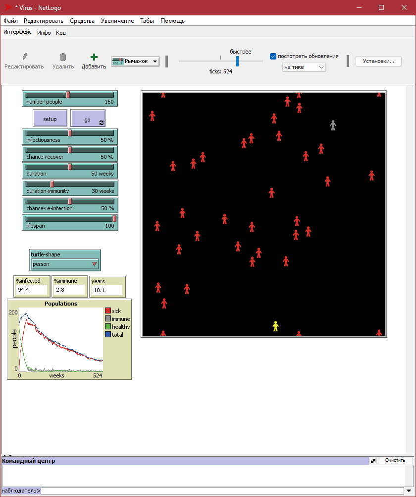
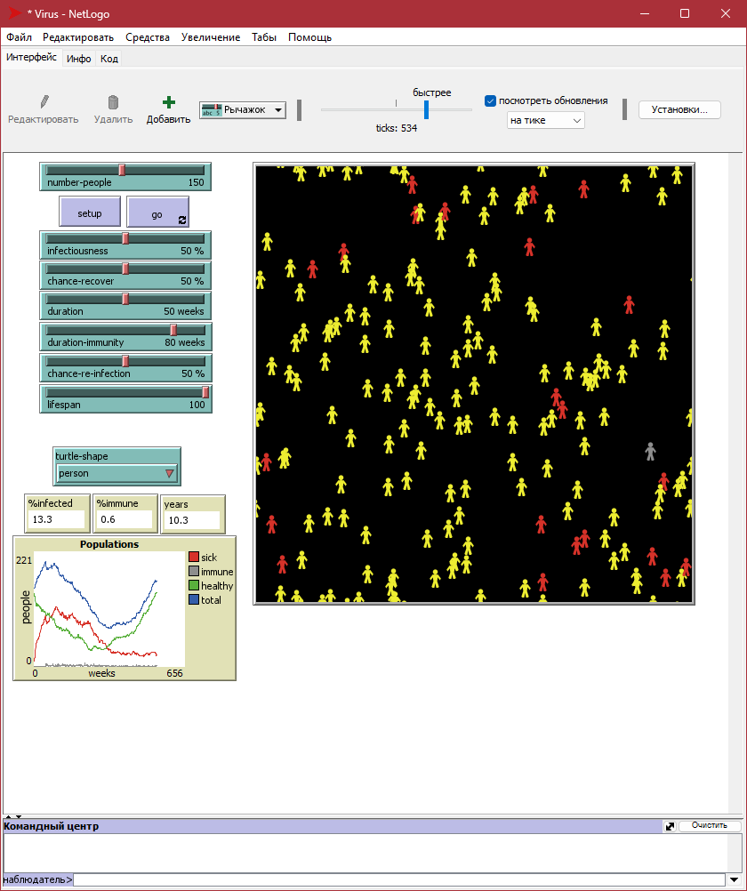

## СПм-22-6, **Поповкін Максим Максимович**
### Лабораторна робота №**2**. Редагування імітаційних моделей у середовищі NetLogo

 

### Варіант 3, модель у середовищі NetLogo:
[Virus](https://www.netlogoweb.org/launch#https://www.netlogoweb.org/assets/modelslib/Sample%20Models/Biology/Virus.nlogo)
Додати вплив віку на інфікування та результат захворювання. Додати вплив ступеня поширення захворювання (поточного відсотка інфікованих) на вірогідність появи нових агентів. Додати можливість регулювання тривалості імунітету та вірогідності захворіти повторно.
 

### Внесені зміни у вихідну логіку моделі, за варіантом:

Додав залежність від віку агента:
<pre>
to get-sick ;; turtle procedure
  set sick? true
  set remaining-immunity 0
  if age > lifespan * 0.7 [
     set sick-time sick-time + 1
  ]
end
</pre>
Логіка така, що якщо агент старший "70% свого часу", то час лікування збільшується.

Також надав змін у процедуру **get-older**, тепер якщо агент прожив "70% життя", то в нього з'являється додаткові 10% на отримання хвороби:

<pre>
to get-older ;; turtle procedure
  ;; Turtles die of old age once their age exceeds the
  ;; lifespan (set at 50 years in this model).
  set age age + 1
  if age > lifespan [ die ]
    [ get-sick ]
    [ set remaining-immunity remaining-immunity - 1 ]
  ifelse sick? 
  [ set sick-time sick-time + 1 ]
  [ if age > lifespan * 0.7 and random-float 100 < 10
    [ get-sick ] 
  ]
end
</pre>

Для додання впливу ступеня поширення захворювання на вірогідність  появи нових агентів модифікував процедуру **recover-or-die**:

<pre>
to recover-or-die ;; turtle procedure
  if sick-time > duration                        ;; If the turtle has survived past the virus' duration, then
  [ ifelse random-float 100 < (chance-recover + %infected / 3)     ;; either recover or di
      [ become-immune ]
      [ die ] ]
end
</pre>

Відтепер ніж більше агентів хворіє тим більше шанс того, що агент одужає та отримає іммунітет.

Для регулювання шансу захворіти повторно та регулювання терміну імунітету вніс зміни у **setup**:
<pre>
to setup
  clear-all
  setup-constants
  setup-turtles
  update-global-variables
  update-display
  reset-ticks
end
</pre>
, щоб значення не задавалися при кожному початку нової симуляції. А також у:

**become-immune**:
<pre>
to become-immune ;; turtle procedure
  set sick? false
  set sick-time 0
  set remaining-immunity duration-immunity
end
</pre>

та **get older**:

<pre>
to get-older ;; turtle procedure
  ;; Turtles die of old age once their age exceeds the
  ;; lifespan (set at 50 years in this model).
  set age age + 1
  if age > lifespan [ die ]
  if immune? [
    ifelse random-float 100 < chance-re-infection
    [ get-sick ] 
    [ set remaining-immunity remaining-immunity - 1 ]
  ]
  ifelse sick? 
  [ set sick-time sick-time + 1 ]
  [ if age > lifespan * 0.7 and random-float 100 < 10 ;; 10% chance old person get sick
    [ get-sick ] 
  ]
end
</pre>

Модель під час симуляції після внесених змін:

### Внесені зміни у вихідну логіку моделі, на власний розсуд:

Додав важіль для максимального віку, що може прожити агент:

Зробив більш індивідуальний підбір кольору агенту:
**update-display**:
<pre>
to update-display
  ask turtles
    [ if shape != turtle-shape [ set shape turtle-shape ]
      set color ifelse-value sick? [ red ] [ ifelse-value immune? [ grey ] [ set-color ] ] ]
end
</pre>
**set-color**:
<pre>
to-report set-color
  if age < 20 * 52
  [report yellow]
  if age >= 20 * 52 and age < 50 * 52
  [report green]
  if age >= 50 * 52
  [report white]
end
</pre>

Після внесених змін, під час симуляції модель виглядає наступним чином:

## Обчислювальні експерименти
### Вплив тривалості імунітету на кількість хворих:
Керуючі параметри мають такі значення:
- **number-people** 150
- **chance-recover** 50%
- **infectiousness** 50%
- **duration** 50
- **chance-re-infection** 50%
- **lifespan** 100

<table>
<thead>
<tr><th>Тривалість імунітету</th><th>% інфікованих</th></tr>
</thead>
<tbody>
<tr><td>10</td><td>82.1</td></tr>
<tr><td>20</td><td>89.55</td></tr>
<tr><td>30</td><td>94.4</td></tr>
<tr><td>50</td><td>86.7</td></tr>
<tr><td>80</td><td>13.3</td></tr>
</tbody>
</table>

Відповідні скріншоти:

10 тижнів імунітету:

20 тижнів імунітету:

30 тижнів імунітету:

50 тижнів імунітету:

80 тижнів імунітету:

Як можна побачити по відповідним скріншотам - тривалість імунітету все ж таки надає вплив, але не дуже помітний.
