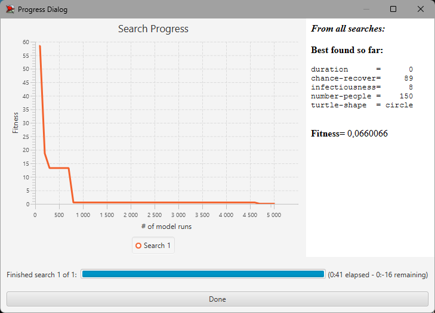

## СПм-22-6, **Поповкін Максим Максимович**
### Лабораторна робота №**3**. Використання засобів обчислювального интелекту для оптимізації імітаційних моделей

 

### Варіант 3, модель у середовищі NetLogo: Virus. Модель поширення захворювання у людській популяції.
[Virus](https://www.netlogoweb.org/launch#https://www.netlogoweb.org/assets/modelslib/Sample%20Models/Biology/Virus.nlogo)

 

### Вербальний опис моделі:
Ця модель імітує передачу та збереження вірусу в людській популяції. Модель ініціалізована 150 людьми, з яких 10 заражені. Люди випадково пересуваються по світу в одному з трьох станів: здорові, але сприйнятливі до інфекції (зелений), хворі та інфекційні (червоний) і здорові та імунні (сірий). Люди можуть померти від інфекції або старості. Коли популяція падає нижче "пропускної здатності" середовища (встановленої на рівні 300 у цій моделі), здорові люди можуть народжувати здорове (але сприйнятливе) потомство.

### Параметри Setup:
- **number-people** - кількість людей на початку.
- **turtle-shape** - метод відображення агентів(люди або бульбашки).

### Параметри, що можуть надавати вплив під час роботи симуляції:
- **infectiousness** - Легкість передавання зарази.
- **chance-recover** - Ймовірність одужати.
- **duration** - Тривалість одужання.

### Показники роботи системи:
- %infected - Процент інфікованих людей.
- %immune - Процент людей з імунітетом.
- %years - Кількість прожитих популяцією років.

 

### Налаштування середовища BehaviorSearch:

**Обрана модель**:
<pre>
C:\Program Files\NetLogo 6.3.0\models\Sample Models\Biology\Virus.nlogo
</pre>
**Параметри моделі** (вкладка Model):  
*Параметри та їх модливі діапазони були **автоматично** вилучені середовищем BehaviorSearch із вибраної імітаційної моделі, для цього є кнопка «Завантажити діапазони параметрів із інтерфейсу моделі»*:
<pre>
["duration" [0 1 99]]
["chance-recover" [0 1 99]]
["infectiousness" [0 1 99]]
["number-people" 150]
["turtle-shape" "person" "circle"]
</pre>
Використовувана **міра**:  
Для фітнес-функції *(вона ж функція пристосованості або цільова функція)* було обрано **значення інфікованих** та вказано у параметрі "**Measure**":
<pre>
%infected
</pre>
Кількість інфікованих повинна враховуватися **в кінці** симуляції тривалістю 3000 тактів, починаючи з 0 такту симуляції.  
*Параметр "**Mesure if**" зі значення true, по суті, і означає, що враховуватимуться всі такти симуляції, а чи не частина їх. Іноді має сенс не враховувати деякі такти через хаос в деяких моделях на початку їх використання. Наприклад, це показано в прикладі з документації BehaviorSearch.  
Параметри "**Setup**" та "**Go**" вказують відповідні процедури ініціалізації та запуску в логіці моделі (зазвичай вони так і називаються). BehaviorSearch в процесі роботи, по суті, замість користувача запускає ці процедури.*  
Параметр зупинки за умовою ("**Stop if**") у разі не використовувався.  
Загальний вигляд вкладки налаштувань параметрів моделі:  

**Налаштування цільової функції** (вкладка Search Objective):  
Метою підбору параметрів імітаційної моделі є **мінімізація** значення – це вказано через параметр "**Goal**" зі значенням **Minimize Fitness**. Тобто необхідно визначити такі параметри налаштувань моделі:
Загальний вигляд вкладки налаштувань цільової функції:  

**Налаштування алгоритму пошуку** (вкладка Search Algorithm):  

Загальний вид вкладки налаштувань алгоритму пошукудля ГА:

Загальний вид вкладки налаштувань алгоритму пошукудля ВП:

 

### Результати використання BehaviorSearch:
Діалогове вікно запуску пошуку:  

Результат пошуку параметрів імітаційної моделі, використовуючи **генетичний алгоритм**:  

Результат пошуку параметрів імітаційної моделі, використовуючи **випадковий пошук**:  

Як видно з результатів оптимізації - в обох випадках - **Випадковий пошук** та **Генетичний Алгоритм** - значення фітнес-функції у кінці досягло однакового результату, але у випадку **ГА** швидкість оптимізації була вище.
